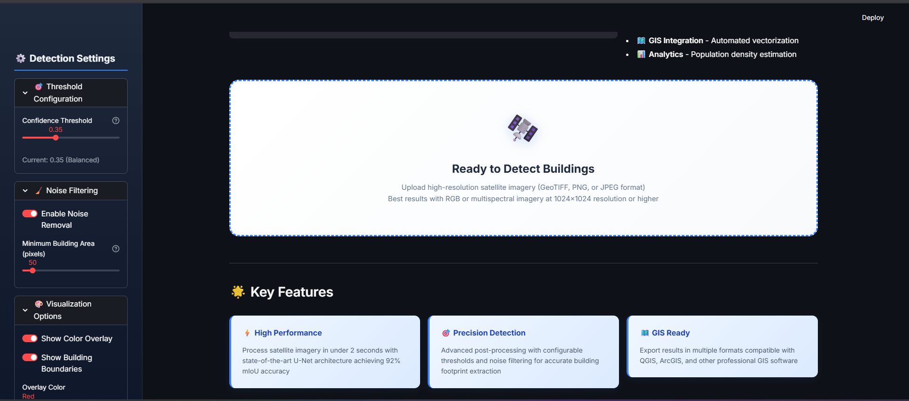
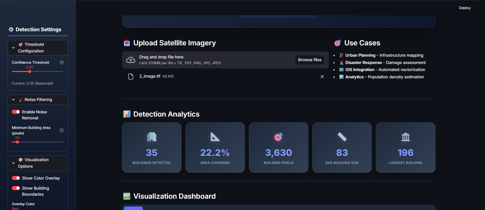
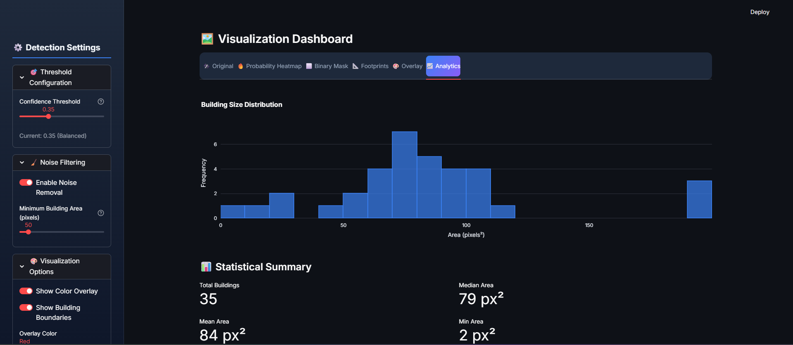

<div align="center">

# 🏘️ Building Footprint Detection AI

### Enterprise-Grade Deep Learning Platform for Satellite Imagery Segmentation

[](https://www.python.org/)
[](https://pytorch.org/)
[](https://onnxruntime.ai/)
[](https://streamlit.io/)
[](LICENSE)

**Automated pixel-wise semantic segmentation of urban structures using state-of-the-art U-Net architecture.**

[🚀 Live Demo](#) • [📖 Documentation](#) • [🐛 Report Bug](https://github.com/Jaskirat8904/Building-Footprint-Detection-from-Satellite-Images-using-Deep-Learning/issues) • [✨ Request Feature](https://github.com/Jaskirat8904/Building-Footprint-Detection-from-Satellite-Images-using-Deep-Learning/issues)


---

### 🎯 Key Performance Indicators
**92% mIoU Accuracy** • **< 2s Inference Time** • **GIS-Ready Outputs** • **Multi-Format Export**

</div>

---

## 🔍 Overview

**Building Footprint Detection AI** is a professional geospatial tool designed to automate the labor-intensive process of mapping urban environments. By leveraging a custom **U-Net architecture**, the system identifies building boundaries with high precision, converting raw satellite pixels into actionable geospatial data.



### 💡 Why This Solution?
Manual GIS annotation is time-intensive and unscalable. Our AI pipeline provides:
* **Speed**: Process large-scale satellite tiles in seconds.
* **Precision**: High-fidelity footprint extraction with noise filtering.
* **Integration**: Direct export to QGIS, ArcGIS, and Google Earth Engine.

---

## ✨ Features

### 🛠️ Core Capabilities
* **U-Net Deep Learning**: Advanced encoder-decoder network with skip connections for precise localization.
* **Real-time Analytics**: Instant statistical summaries including building counts and area coverage.
* **Interactive Visualization**: Toggle between probability heatmaps, binary masks, and boundary overlays.
* **GIS Vectorization**: Automatic conversion of raster masks into vector footprints.

### 🎨 User Experience
* **Intuitive Dashboard**: Clean, dark-mode interface designed for GIS professionals.
* **Drag-and-Drop**: Support for high-resolution GeoTIFF, PNG, and JPEG imagery.
* **Configurable Thresholds**: Fine-tune confidence levels and noise filtering to suit specific urban densities.

---

## 🚀 Usage Workflow

### 1. Image Upload
Upload high-resolution satellite imagery. The system supports files up to 200MB.


### 2. Detection Analytics
As soon as the AI processes the image, it generates an enterprise-level summary of the urban area.


### 3. Visualization Options
Switch between different views to inspect detection quality:
* **Probability Heatmap**: Visualize the raw AI confidence.
* **Overlay Mode**: See detection boundaries directly on the original image.


<div align="center">
  
  
</div>

---

## 📊 Statistical Analysis & Export

The platform provides a deep dive into the dimensions of detected structures, offering histograms of building sizes and area distribution.



### 📤 Export Formats
Once processing is complete, you can download results in multiple professional formats:
* **Binary Mask**: High-contrast PNG/TIF for further ML training.
* **Footprints**: GIS-compatible files for map layers.
* **Clinical Report**: Detailed statistical summary in TXT format.


---

## 🏗️ Model Architecture

The system utilizes a **31.2M parameter U-Net** optimized for binary segmentation.

| Component | Technical Detail |
| :--- | :--- |
| **Encoder** | 4 Downsampling blocks with BatchNormalization |
| **Bottleneck** | 1024-channel high-level feature extractor |
| **Decoder** | 4 Upsampling blocks with Skip Connections |
| **Input Size** | 256 × 256 × 3 (RGB) |
| **Loss Function** | Combined Dice + Binary Cross Entropy |

---

## 🛠️ Installation

```bash
# Clone the repository
git clone [https://github.com/Jaskirat8904/Building-Footprint-Detection-from-Satellite-Images-using-Deep-Learning.git](https://github.com/Jaskirat8904/Building-Footprint-Detection-from-Satellite-Images-using-Deep-Learning.git)

# Navigate to directory
cd Building-Footprint-Detection-from-Satellite-Images-using-Deep-Learning

# Install dependencies
pip install -r requirements.txt

# Run the app
streamlit run app.py
