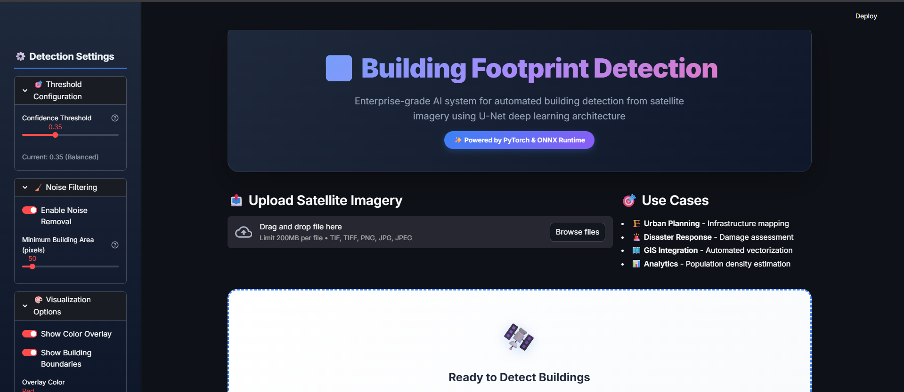
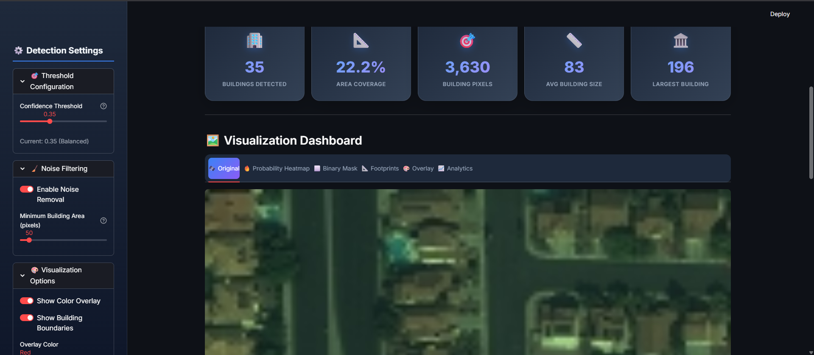
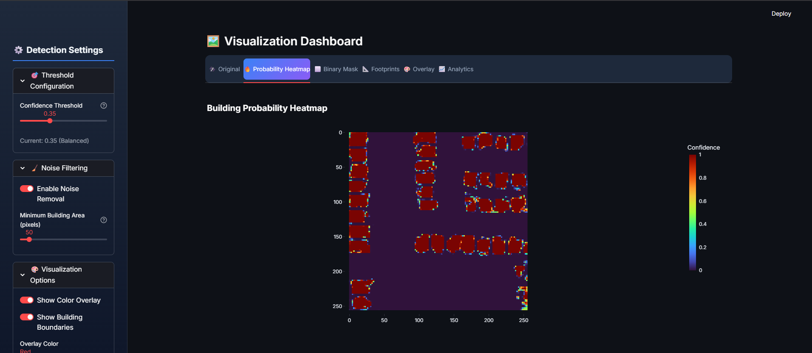
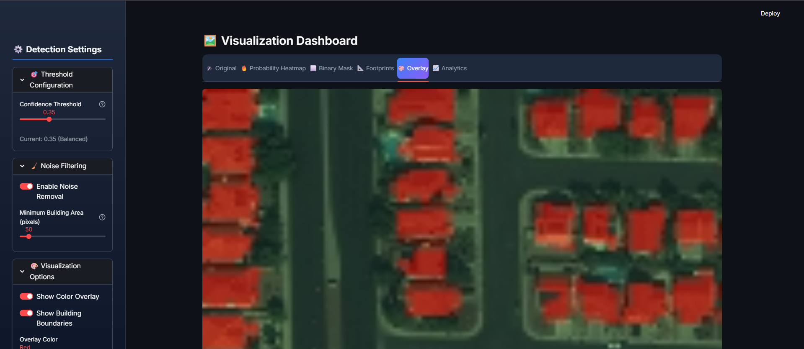
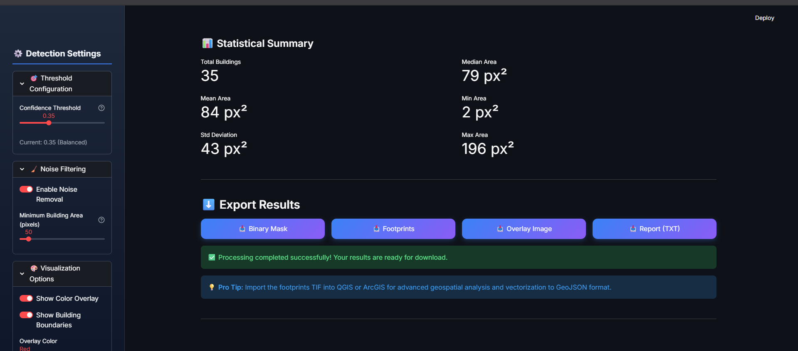

<div align="center">

# 🏘️ Building Footprint Detection AI

### Enterprise-Grade Deep Learning Platform for Satellite Imagery Segmentation

[](https://www.python.org/)
[](https://pytorch.org/)
[](https://streamlit.io/)
[](LICENSE)

**Automated pixel-wise semantic segmentation of urban structures using a custom U-Net architecture.**



---

### 🎯 Key Performance Indicators
**91.10% Pixel Accuracy** • **0.836 Mean IoU** • **GIS-Ready Outputs** • **Real-time Inference**

</div>

---

## 🔍 Overview

**Building Footprint Detection AI** is a professional geospatial tool designed to automate the labor-intensive process of mapping urban environments. By leveraging a custom **U-Net architecture**, the system identifies building boundaries with high precision, converting raw satellite pixels into actionable geospatial data.

### 📊 Model Performance

The model has been rigorously evaluated on both validation and test sets, demonstrating high stability and generalization across unseen satellite tiles.

| Metric | Test Set | Validation Set |
| :--- | :--- | :--- |
| **Mean IoU** | **0.8365** | 0.6707 |
| **Accuracy** | **91.10%** | 91.16% |
| **Precision** | 0.8227 | 0.8302 |
| **Recall** | 0.7846 | 0.7773 |

---

## ✨ Features

### 🛠️ Core Capabilities
* **U-Net Deep Learning**: Advanced encoder-decoder network with skip connections for precise localization.
* **Real-time Analytics**: Instant statistical summaries including building counts and area coverage.
* **Interactive Visualization**: Toggle between probability heatmaps, binary masks, and boundary overlays.
* **GIS Vectorization**: Automatic conversion of raster masks into vector footprints (.geojson).



---

## 🏗️ Model Architecture

The system utilizes a **31.2M parameter U-Net** optimized for binary segmentation.

| Component | Technical Detail |
| :--- | :--- |
| **Encoder** | 4 Downsampling blocks (64 → 512 channels) |
| **Bottleneck** | 1024-channel high-level feature extractor |
| **Decoder** | 4 Upsampling blocks with Skip Connections |
| **Output Layer** | 1×1 Conv with Sigmoid activation |

---

## 💻 Visualization Dashboard

The platform provides multiple ways to inspect detection quality and export data for professional GIS workflows.

<div align="center">
  
  
</div>

### 📤 Export Formats
* **Binary Mask**: High-contrast PNG/TIF for further ML training.
* **Footprints**: GIS-compatible files for map layers.
* **Statistical Report**: Detailed area breakdown in TXT format.



---

## 🚀 Quick Start

```bash
# Clone the repository
git clone [https://github.com/Jaskirat8904/Building-Footprint-Detection-from-Satellite-Images-using-Deep-Learning.git](https://github.com/Jaskirat8904/Building-Footprint-Detection-from-Satellite-Images-using-Deep-Learning.git)

# Install dependencies
pip install -r requirements.txt

# Run the app
streamlit run app.py
